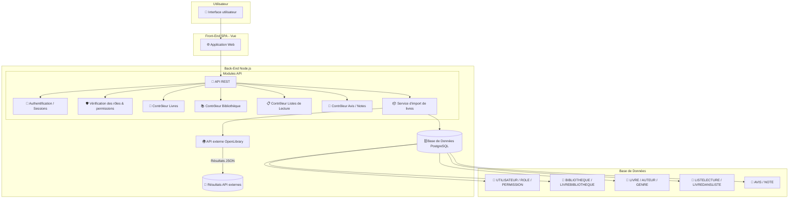

# Diagramme d'architecture

```mermaid
graph TD

    subgraph Utilisateur
        A1[👤 Interface utilisateur]
    end

    subgraph Front-End [Front-End SPA - Vue]
        A1 --> FE[🌐 Application Web]
    end

    subgraph Back-End [Back-End Node.js]
        FE --> API[🔌 API REST]

        subgraph Modules API
            API --> AUTH[🔐 Authentification / Sessions]
            API --> PERMS[🛡️ Vérification des rôles & permissions]
            API --> LIVRES[📖 Contrôleur Livres]
            API --> BIB[📚 Contrôleur Bibliothèque]
            API --> LISTES[📋 Contrôleur Listes de Lecture]
            API --> AVIS[💬 Contrôleur Avis / Notes]
            API --> IMPORT[📦 Service d’import de livres]
        end

        IMPORT --> EXTAPI[🌍 API externe OpenLibrary]
        EXTAPI -->|Résultats JSON| BOOKS_API[(📘 Résultats API externes)]
        IMPORT --> DB[(🗄️ Base de Données PostgreSQL)]
    end

    subgraph Base_Données [Base de Données]
        DB --> USERS[📁 UTILISATEUR / ROLE / PERMISSION]
        DB --> BIBLIOS[📁 BIBLIOTHEQUE / LIVREBIBLIOTHEQUE]
        DB --> LIVRES_ENT[📁 LIVRE / AUTEUR / GENRE]
        DB --> LISTES_ENT[📁 LISTELECTURE / LIVREDANSLISTE]
        DB --> AVIS_NOTE[📁 AVIS / NOTE]
    end
```